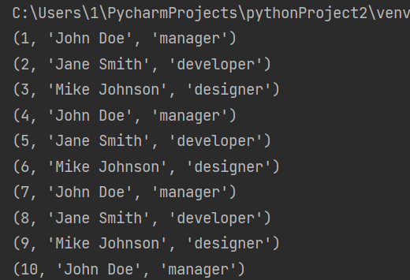
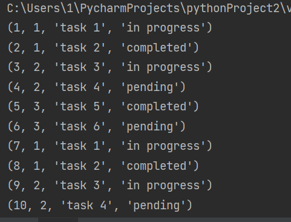

#Лабораторная работа №14.
##Основы БД
1) Спроектируйте БД с использованием crow’s foot notation.

2) Создайте таблицы БД и заполните данными. Для генерации данных можно использовать сервис https://www.mockaroo.com/.

3) Напишите несколько запросов для выборки данных из всех таблиц.
 
4) Оформите отчёт в README.md. Отчёт должен содержать:
+ Условия задач
+ Описание проделанной работы
+ Скриншоты результатов


Вариант 6:
База данных учета проектов в компании:
+ Таблица Проекты с информацией о текущих проектах компании, такой как название, дата начала и дата завершения.
+ Таблица Сотрудники с информацией о сотрудниках, работающих над проектами, например, их имена и должности.
+ Таблица Задачи с информацией о задачах, относящихся к проектам, такой как описание и статус выполнения.

Программы, решающая задачу

```python
import sqlite3

# создаем соединение с базой данных
conn = sqlite3.connect('company_projects.db')
cur = conn.cursor()

# создаем таблицу проектов
cur.execute('''
create table if not exists projects (
    id integer primary key,
    name text,
    start_date date,
    end_date date
)
''')

# создаем таблицу сотрудников
cur.execute('''
create table if not exists employees (
    id integer primary key,
    name text,
    position text
)
''')

# создаем таблицу задач
cur.execute('''
create table if not exists tasks (
    id integer primary key,
    project_id integer,
    description text,
    status text,
    foreign key (project_id) references projects(id)
)
''')

# заполняем таблицы данными
cur.execute('''
insert into projects (name, start_date, end_date) values
('project A', '2024-01-01', '2024-01-15'),
('project B', '2024-02-01', '2024-02-28'),
('project C', '2024-03-01', '2024-03-31')
''')

cur.execute('''
insert into employees (name, position) values
('John Doe', 'manager'),
('Jane Smith', 'developer'),
('Mike Johnson', 'designer')
''')

cur.execute('''
insert into tasks (project_id, description, status) values
(1, 'task 1', 'in progress'),
(1, 'task 2', 'completed'),
(2, 'task 3', 'in progress'),
(2, 'task 4', 'pending'),
(3, 'task 5', 'completed'),
(3, 'task 6', 'pending')
''')

# сохраняем изменения и закрываем соединение
conn.commit()
conn.close()
```
Программа выборки сотрудников
```python
import sqlite3

# выборка данных из таблицы сотрудников
conn = sqlite3.connect('company_projects.db')
cur = conn.cursor()

cur.execute('select * from employees')
rows = cur.fetchall()

for row in rows:
    print(row)

conn.close()
```
Программа выборки проектов
````python
import sqlite3

# выборка данных из таблицы проектов
conn = sqlite3.connect('company_projects.db')
cur = conn.cursor()

cur.execute('select * from projects')
rows = cur.fetchall()

for row in rows:
    print(row)

conn.close()
````

Программа выборки задач
````python
import sqlite3

# выборка данных из таблицы задач
conn = sqlite3.connect('company_projects.db')
cur = conn.cursor()

cur.execute('select * from tasks')
rows = cur.fetchall()

for row in rows:
    print(row)

conn.close()
````


2. Результаты решений:





